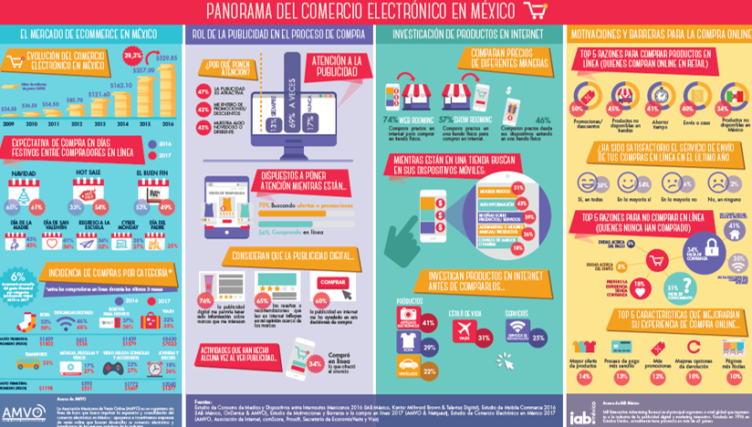
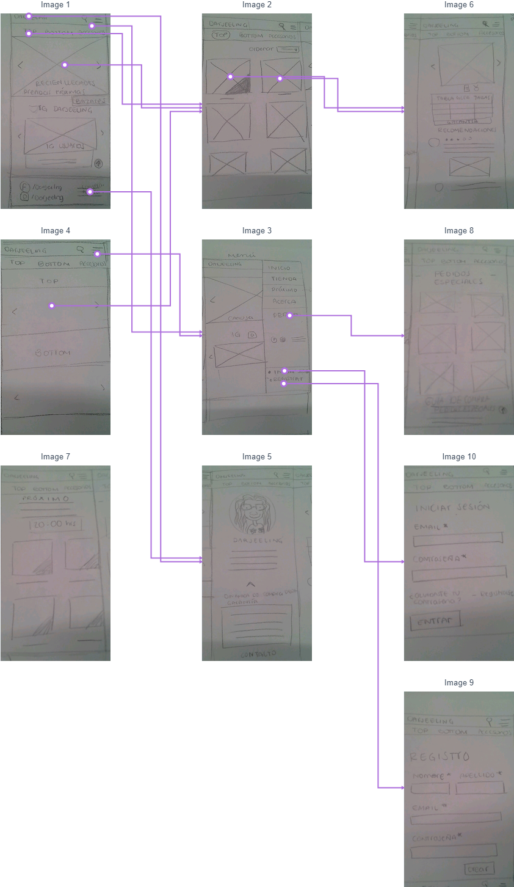

¿Qué me pongo hoy?

Para ir al trabajo, para ir a la universidad, para salir con los amigos;
sea cual sea lo que vamos a hacer, siempre tenemos que pensar: ¿Qué me pongo hoy?
El comprar ropa, conlleva todo un proceso, desde entrar a cualquier tienda convencional y buscar algún artículo de temporada, 
la talla correcta, el color a elegir, etc. Y ni hablar del proceso de fabricación y distribución.
Comprar artículos de primera necesidad como la ropa es una de las principales actividades del ser humano.

Que con el tiempo se ha ido simplificando; gracias a las nuevas tecnologías no necesariamente tenemos que desplazarnos a los almacenes y centros comerciales, evitando así largas filas, escalas, tal como el cajero electrónico; sin mencionar el tiempo invertido en cada una de esas actividades. 

Con la llegada del "E-commerce" la forma de comprar cambió para siempre. 

## E-COMMERCE

El denominado e-commerce o comercio electrónico es un método de compraventa de productos, servicios o bienes, cuyo medio principal es el internet.

Esta forma de comercio ha ido en ascenso con el auge de Internet en todos los aspectos de la vida cotidiana, así como por el creciente interés de los usuarios a comprar de forma online.

El e-commerce cuenta con una serie de ventajas respecto al comercio tradicional:

- Está disponible las 24 horas del día durante los 365 días del año en sus correspondientes plataformas.

- Difícilmente existen limitaciones geográficas para el cliente.

- Posibilidad de analizar a los clientes al trabajar online con la finalidad de mejorar la comunicación y diseñar campañas especializadas.

-  Siempre es posible extender el alcance de tu emprendimiento a nuevos usuarios y clientes potenciales.

## Objetivo del proyecto

### Darjeeling MX es una tienda en línea dedicada a la ropa de segunda mano, vintage, saldos y productos de importación. Cuya dinámica de venta se realiza unicamente por Facebook e Instagram.

Pero **Darjeeling** Mx no es una tienda en línea convencional, pues su creadora fomenta el consumo responsable y sostenible, con la finalidad de reducir el impacto ambiental y tener alternativas más auténticas a la hora vestir. 

La marca es precursora de un colectivo enfocado en la sustentabilidad, un consumo más consciente y menos derrochador.

Más información sobre "The Vintage Clan":
https://www.themonopolitan.com/2019/03/the-vintage-clan?fbclid=IwAR1raOKso0tWBVKBJW5hh3PLMuErH9kSHH3j5kU0ssD3kHS4vEslMb2hcLM

## Definición del público objetivo
### User persona

Los principales usuarios de Darjeeling se ubican en un rango de edad de entre 25-40 años.
Se trata de estudiantes, universitarias, madres jóvenes, profesionistas y extranjeros que visitan los bazares que realiza. Sus clientes tienen en común el gusto por las prendas únicas y de buena calidad, que sean de precio accesible y les brinde confianza durante el proceso de compra.

El objetivo de las usuarias es adquirir prendas de buena calidad, que puedan visualizar artículos a cualquier hora del día, hacer compras sin salir de casa, de manera práctica y ágil, evitar filas, pagar ya sea en efectivo, depósito o transferencia, precios accesibles, que la compra sea siempre segura al igual que el envío. 

Buscan calidad garantizada en los artículos de importación y que el status de las prendas Vintage y segunda mano sea siempre establecido desde que se muestra la prenda en venta. 
Poder encontrar piezas de ropa auténticas y llenas de originalidad; sin embargo, la tienda también ofrece la oportunidad de comprar piezas de importación difíciles de encontrar en cualquier centro comercial.  

  

## Entrevista con la creadora de la marca  

#### Audio de la entrevista realizada a Pilar Figueroa

[Audio entrevista aquí](https://drive.google.com/open?id=1pOYIHEF5qfTNvu0ijx1p0s8pPH_lYsI1)

###  Entrevista con Pilar Figueroa

## Lo que sus clientes opinan

A través de un formulario y entrevistas a sus clientes de diversos llegamos a identificar las áreas de oportunidad a las que se enfrenta el emprendimiento. 
Las cuales se resumen en:

-  Constancia para subir nuevo stock
-  Saber si las prendas aún están disponibles 
- Encontrar una guía de compra si eres nueva en la página
- Encontrar su talla o posibilidad de hacer pedido especial
- Encontrar álbum de cada tipo de prenda
- Disponibilidad para más entregas

Realizamos entrevistas con usuarias de la marca para saber su experiencia, lo que más les gusta durante y antes del proceso de compra y lo que consideran sus áreas de oportunidad. 
De dichas entrevistas se extrajeron los siguientes datos:

### Audio entrevista con Paulina Treviño:
 -  [aquí](https://drive.google.com/open?id=1um1IOSHB87-kAJt3vSNJhLTA4k16dZcJ)

### Audio entrevista con Sthepany Salazar :
-  [aquí](https://drive.google.com/open?id=18lpXI5HTSueyOL1ZIO_p8qul33Pfx2TB)

### Audio entrevista con Magenta Luna :
-  [aquí](https://drive.google.com/open?id=1moZF5mNqJI2rfQ74sFXv762TL_nemDG4)

### Recopilación de motivaciones por las cuales compran en Darjeeling Mx

**Formulario** que se mandó a usuarias de la marca, con las que no tratamos de manera directa: https://docs.google.com/forms/d/1H71DA06hZkZXfOVMaNmHyvuYg6knK4R5AhIgVHHrLh8/edit#responses

 

### Buscando el arquetipo de cliente ideal:

Ejes de comportamiento de las usuarias, que son un referente para determinar lo que priorizan a la hora de comprar.

## Problemas identificados en la investigación 

Identificamos las razones por las que las personas no confían en el E-Commerce:

- Desconfían de los métodos de pago por internet
- Dudan de las tallas y cómo les quede
- No sienten seguridad al encontrarse con un extraño
- Temen que la prenda no corresponda con la descripción
- Temen ser estafados
- No les gusta esperar los envíos

Lo anterior fue determinado mediante entrevistas, donde nos hablan sobre sus miedos, desconfianza, creencias, experiencias pasadas, que no cubra sus expectativas, prefieren la experiencia de compra tradicional, los envios son largos y consideran el proceso engorroso.

### Entrevistas de audio "¿Por qué no compras por internet?":

-  [Aquí](https://drive.google.com/open?id=1yoGUzUq9rn7AyEI-GPy8B2ZhoL6y7N8S
)

### Factores que limitan acercarse al **E-Commerce**

## Customer Journey Map 
### Indica el nivel de satisfacción en que se encuentran los clientes durante cada fase de la experiencia de comprar en la tienda.

## Mapeo de todos los involucrados 

Resulta de interés tener en cuenta ciertos indicadores de poder e influencia, para saber en dónde podría el emprendedor agudizar sus esfuerzos, optimizar algunos recursos, realizar acciones concretas, reformular estrategias o potenciar ciertos canales de comunicación.

### Stake Holders Map

### Esquema circular

Representa las partes involucradas con la marca y todas sus implicaciones e interacciones, directas e indirectas . 
Al tenerlo plasmado entendemos la influencia e importancia de cada elemento relacionado.

### El perfil de facebook se sometió al siguiente análisis,  comprarando su actividad con otra página de venta en facebook

## Historias de usuario

-  Yo como usuario quiero un sitio donde vendan ropa auténtica de buena calidad
-  Yo como usuario quiero encontrar precios accesibles
-  Yo como usuario quiero poder filtrar la búsqueda por tipo de artículo, talla, tipo de prenda y disponibilidad
-  Yo como usuario quiero seleccionar una prenda y que está despliegue sus características 
-  Yo como usuario quiero leer recomendaciones de otras compradoras sobre la prenda que me interesa adquirir
-  Yo como usuario quiero un trato personalizado, confiable y seguro
-  Yo como usuario quiero tener diversos métodos de pago que se ajusten a mis necesidades
-  Yo como usuario quiero disponer de varios sistemas de entrega

### El reto de diseño

**¿Cómo podemos hacer que Darjeeling sea una experiencia de compra satisfactoria y memorable?**

## Benchmark

Decidimos extender la investigación a sitios de venta de importación, páginas de facebook, plataformas consolidadas en el e.commerce, para evaluar sus atributos positivos y sus puntos de dolor. 

Consultamos, entre otras plataformas:
1. [SHEIN](https://www.shein.com.mx/?url_from=mxgooglebrandshein_shein02_20180412&gclid=Cj0KCQjwpsLkBRDpARIsAKoYI8yn4RBClCT4THrk6oEoX9srsHHXFHHQMNdu_1R_ZYughpIcVSjC3FUaAm4XEALw_wcB)

2. [BE MEOW](https://www.kichink.com/stores/bemeow)

3. [ZARA](https://www.zara.com/mx/es/preotono-l1438.html?v1=1181417)

4. [ALI EXPRESS](https://best.aliexpress.com/?lan=en&af=60581&cn=6814&cv=12071&dp=102db1d243520a9da51b2b5ed02610&aff_platform=promotion&cpt=1552985664682&sk=BHdg6fe&aff_trace_key=000942985fe34713a335d8e47020043d-1552985664682-06776-BHdg6fe&terminal_id=eb2f8b9d3ec045179b335422d060468e)

### Arrojando los siguientes datos:
Benchmark de comercio en facebook

Benchmark de comercio por importación 

## Definición de la solución/producto

Para dar solución a las problemáticas anteriormente planteadas buscamos satisfacer los siguientes aspectos para garantizar una experiencia de compra satisfactoria:

-  Método de pago seguro y diverso
-  Precios por debajo de los encontrados en centros comerciales
- Experiencia de compra ágil y dinámica
-  Confianza en la marca
-  Garantía de satisfacción
-  Conocer con anticipación el stock, antes de estar disponible
-  Tener plena certeza del status de las prendas exhibidas 

Insights

### Propuesta de valor del sitio que a crear...

Dentro de la interfaz el usuario va a tener los siguientes contenidos para su mejor interacción durante la experiencia:

- Conocer la marca, como surge, y lo que promueve.
-  Conocer el rostro de la creadora, y un poco sobre quien es, de manera sutil 
-  "Reacción" con un icono para ganar las prendas 
-  "Reacción" con un icono para ponerse en lista de espera 
-   Sección que muestra avances de lo que llegará próximamente
-  Sección que muestra los artículos recién llegados 
-  Menú desplegable 
-  Barra de categorías 
-  Guía de compra
-  Sección de pedidos especiales
-  Posibilidad de registrarse para obtener beneficios y personalizar la experiencia
-  Iniciar sesión 
-  Tener siempre redes sociales y contacto a la vista 
-  Vínculo a instagram en donde se muestra a los usuarios utilizando artículos adquiridos en la tienda
-  Buscador para filtrar por talla, disponibilidad, tipo de prenda 
-  Bolsita de compra para guardar sus prendas antes de realizar pago
-  Notificación en la bolsita
-  Guía de tallas 
-  Recomendaciones de clientes sobre su experiencia
-  Entre otras cosas

  

### Bocetos y sketch:

## Link a prototipo navegable

**Prototipo de baja fidelidad**, desarrollado en MARVEL, puede visitarlo aquí:

https://marvelapp.com/44c4437/screen/54469875

**Prototipo de media fidelidad**, desarrollado en MARVEL, puede visitarlo aquí:

https://marvelapp.com/44c4437/screen/54505544

**Prototipo de alta fidelidad**, desarrollado en MARVEL puede visitarlo aquí:

https://marvelapp.com/5d44jeg/screen/54651909

### Presentación para el cliente:
https://docs.google.com/presentation/d/1tnwCVurt7EwAQEvGHCVDgLnSNq46PGSRrzsBo5gMxvU/edit?usp=sharing

### ¿De qué forma el producto  está resolviendo sus problemas?

Explicación de cómo los contenidos y funcionalidades resuelven cada uno de las necesidades del usuario final.

-  Al inicio te engancha con una selección de productos que estarán próximamente en la página 
-  Con la implementación de la API de Instragram resolvemos el que sean usuarios reales usando los productos de la tienda y le da un plus al posicionarse como tendencia a través de hashtags
-  Validamos la confianza a través de Quotes de usuarios reales
-  La manera de encontrar productos es rápida es eficaz gracias al menú fijo superior

-  Los usuarios también tienen acceso al buscador y a la bolsa de compra gracias al diseño intuitivo de la interfaz
-  El menú lateral permite acceder a opciones más específicas de la tienda en línea
-  Sección "¿Cómo comprar? te explica de manera detallada el método en el que se compra en esta tienda en línea
-  Sección "Próximamente" te da una experiencia diferente a otras tiendas en línea al comprar productos de importación, con una dinámica de "preview" de artículos que llegarán pronto y eso te mantiene atenta para llevarte lo mas nuevo de la tienda , garantizando visitas al sitio y posibles compras extra a las esperadas , generando una experiencia dinámica
-  Sección "A cerca de" pretende dar confianza a las usuarias, mostrando una identidad real que trabaja detrás de la marca y haciendo sentir que su compra será segura
- Sección "Pedidos especiales" permite que las categorías funcionen como un catálogo para futuras compras 
-  "Iniciar sesión" permite guardar un perfil para subir futuras recomendaciones o comentarios sobre los productos de la marca y obtener promociones y descuentos
-  Si te registras, en tu primer compra te llevas un regalo sorpresa 
-  Las prendas tienen una etiqueta que muestra el status (disponible, agotado, prenda única)
-  Junto a cada precio encontramos el ícono "Bolsa de compra" para realizar una compra express
-  Al entrar a la descripción de la prenda te muestra un carrusel de las diferentes vistas de la misma prenda
-  Con la "Guía de tallas" resolvemos la desconfianza para comprar el línea y que no te sientas satisfecha con el artículo 
-  También hay una sección desplegable con las recomendaciones y comentarios de las usuarias que ya adquirieron esa prenda
- La prenda puede ser calificada y te muestra el promedio de satisfacción con el artículo
-  Para realizar tu compra tendrás que hacer "double tap" y se agregará a tu bolsa de compras o te notificará si estás en lista de espera
-  Al tener tus productos en la bolsa de compra puedes terminar tu pedido con una serie de opciones que se adecúan a tus necesidades que son: 
-  Forma de pago: Efectivo (contra-entrega, oxxo), tarjeta de débito/crédito (ingresando datos de la tarjeta) o depósito/transferencia (depositando a la cuenta directa de la tienda)
-  Forma de envío: Presencial (horario y lugar fijo de entrega), envío estándar (a través de un servicio de  paqueteria) o envio express (con costo extra)

## Testeo del prototipo

Se testeó cada prototipo y rescatamos lo siguiente, los cambios ya fueron implementados en cada iteración:

# Plataforma de ventas en línea "Business model"

Cuáles son los objetivos del negocio en relación con el producto

## Presentación de la solución:

### Video-demo:

## Investigación de campo 

### The Vintage Collective

El pasado 16 y 17 de Marzo se llevó a cabo la tercera edición de " The Vintage Clan" 

### Fuentes:
-  abi.com
-  themonopolitan.com

### Herramientas:
-  Marvel 
-  Illustrator
-  Miro
-  Google Doc
-  Google Form

### Autoras:
-  Andrea Cruz Hernández
-  Karen Ramírez Legorreta

### Agradecimientos:

-  A nuestros couch por el feedback
-  A nuestras entrevistadas: Magenta, Sthepy, Pau y mas usuarias por el tiempo que nos regalaron 
-  A Pilar Figueroa por ser tan atenta, la comunicación, las facilidades prestadas y la hospitalidad 
-  Nuestras compañeras que nos dieron su valiosa opinión 

## Preámbulo

Los modelos de negocio que hicieran exitosas a empresas en el pasado, no son los mismos que pueden llevar al éxito a las 
empresas en la actualidad. El mundo ha cambiado y tenemos oportunidades de crecimiento para la generación de innovadores 
modelos de negocio que permitan a los emprendedores brindar soluciones por medio de la transformación de la industria. Es 
importante que los modelos de negocio tradicional integren plataformas de e-commerce viceversa. La época de los pure players 
se acerca a su fin.

Tan solo en México durante 2016 el 75% de los internautas Mexicanos realizaron una compra en línea. En 2017 el 65.5% de la 
población tuvo acceso a Internet, lo que equivale a 85 millones de personas, de las cuales el 32% ya había hecho alguna compra 
por internet.

El e-commerce en México tiene un gran potencial de crecimiento, México necesita casos de éxito, pero estos casos no se 
conseguirán en corto plazo, esto será el resultado de construir un círculo virtuoso donde quepan el progreso de la economía y 
el de la sociedad.

¿Podemos como País estar preparados para escalar modelos de negocios que tengan cabida en la nueva era?

## Introducción

### “Nuevo portal de e-commerce”

Con la finalidad de reducir la brecha tecnológica entre las y los propietarios de pequeños emprendimientos, lanzamos una 
iniciativa a través de la cual las estudiantes del track de UX podrán elegir a **uno** de estos negocios para asesorarles y 
crear un portal desde donde los consumidores puedan acceder a sus productos y servicios más fácilmente e incluso realizar una 
compra. Entre los emprendimientos que puedes elegir están:

- Bio Aquatic
- Cucú Caramelo
- Almas Dulces
- Vaca Sagrada
- Luna Maya 
- Solovino Club
- Yi-yi portabebés
- Kuuch Kalán
- Darjeeling MX
- Juntitos los dos

Consulta la información de estos emprendimientos [aquí](https://docs.google.com/spreadsheets/d/1bkLd6lVd0Ev3ytCfX_20_q8wL_ENKhYXEsSU8MWNHA8/edit#gid=0)

Luego de elegir con quién trabajarás, ayudarás al emprendedor o emprendedora por medio de un estudio inicial a poder 
visualizar cómo debería ser este portal de ventas, así como una mejor forma de ofrecer los productos a los consumidores. Para 
ello, necesitarás averiguar cómo son las y los usuarios que utilizarían este canal de venta y cuáles son sus motivaciones, 
cómo es el mercado actual en el que incursionarán; y que propongas una visión de cómo podría plantearse este nuevo canal.

Una vez conozcas a los posibles compradores debes formular una propuesta de
valor. Esto quiere decir que debes pensar cómo este portal va a comunicar sus
beneficios a los usuarios y cómo va a vender sus productos. Para que guíes a la
empresa que elijas a entender tu visión, esperan que les hagas una propuesta de
cómo podría ser el portal donde las personas puedan buscar, ver, elegir y
comprar sus productos.

## Objetivos de aprendizaje

El objetivo principal de aprendizaje de este proyecto es entender cómo pasamos
de lo que un cliente quiere alcanzar a la definición de un producto digital en
poco tiempo. Entender los principales pasos y preguntas que debemos hacernos,
cómo involucrar a los usuarios y su feedback y cómo usar esos resultados sin
perder de vista los objetivos iniciales.
Esperamos que en este proyecto puedas entender las necesidades y falencias de
las empresas, aprender y empezar a empaparte de los posibles modelos de negocio
así como investigar a su audiencia, los usuarios que consumen sus productos,
entendiendo sus preferencias y contexto en el que lo hacen.

De la misma manera deberás definir cuál es la mejor forma de ofrecerle los
productos de tu cliente a sus usuarios, y, pensando en una propuesta de valor y
sus objetivos. También, deberás definir los contenidos, la interacción y el
diseño del proceso a partir del cual el usuario podrá hacer sus pedidos en esta
plataforma.
Este proyecto se debe "resolver" en parejas, por lo que un objetivo importante
es ganar experiencia en trabajos con entrega grupal. Cada uno de las integrantes
será responsable de una parte del trabajo: (1) el entendimiento del problema y
(2) planeamiento y validación de la solución.

## Tópicos a cubrir

Para completar este proyecto tendrás que familiarizarte con conceptos como: UX
research (entrevistas, benchmark), arquitectura de la información (flujo de
contenido, mapa de sitio), diseño visual y de interacción (wireframes y
prototipado), y user testing.

## Consideraciones generales

Para ser una gran UX no sólo debes familiarizarte con los conceptos sino,
también, poner a prueba tus habilidades blandas. El uso de tu curiosidad y
empatía son claves para el éxito laboral.
Para poder realizar una buena entrevista, un benchmark o un user testing
necesitas en todo momento estar atenta al cómo y no sólo al qué. En este
sentido, es esencial que practiques el modo en que te comunicas frente al
cliente y el usuario. Debes pensar quiénes son y qué es lo que necesitan, y no
sólo enfocarte en lo que tú quieres comunicar.

* Relación con el cliente: la empresa miembro con la que te toque trabajar será
tu cliente. Saber relacionarte con ellos no es fácil. Para comenzar una buena
relación con el cliente debes escuchar de manera activa qué es lo que necesitan,
haciendo preguntas que te ayuden a entender sus necesidades para luego buscar
cómo resolverlas. No trates de dar soluciones inmediatas, escucha y pregunta, la
curiosidad es clave para entender la problemática. El problema del cliente no
siempre es el primero que parece, debes investigar la empresa y la competencia
para entender lo que sucede. Para mantener una buena relación con los clientes
debes mostrarle cómo se beneficiarán de lo que ofreces; enséñale los posibles
resultados y el beneficio que ellos podrían obtener. También debes estudiar las
mejores prácticas en la industria del comercio electrónico para poder mostrarle
al cliente casos de éxito.

* Benchmark: revisar referencias y dar referencias es clave para tu relación con
el cliente. Antes de comenzar a crear cualquier producto debes revisar qué está
haciendo la competencia o industrias similares. De esta manera, puedes traer
buenas prácticas y evitar replicar aquellas que no son exitosas. Esto al cliente
le da la confianza de que efectivamente tienes conocimiento de su problemática y
que has estudiado todas las posibles soluciones. Para que el benchmark sea
efectivo, tu curiosidad y pensamiento crítico deben ser altos; no sólo buscar
las referencias que resulten obvias, sino otras industrias que puedan funcionar
de manera similar o empresas pequeñas que están teniendo casos de éxito.

* Presentación del plan, a dónde vas a ir y por qué: al resolver la problemática
debes realizar un plan de trabajo, donde se visualicen las herramientas que
estás utilizando y por qué las escogiste. No todas las problemáticas requieren
que utilices las mismas herramientas. Debes utilizar la que mejor se ajuste. Es
importante que siempre sustentes tu idea, no se trata de trabajar de manera
mecánica para entregar algo al cliente, sino argumentar por qué esa es la mejor
manera de aproximarse a una posible solución.

* Testing centrado en el usuario: Realizar las pruebas con los usuarios
garantiza que los problemas se detecten antes, las buenas ideas se introducen
más rápido y se reducen los esfuerzos de diseño y desarrollo de productos
innecesarios. Steve Jobs, una vez dijo: "El diseño no es sólo cómo se ve y cómo
se siente. El diseño es cómo funciona”. Las pruebas de usabilidad son una
técnica que ayuda a evaluar un producto al probarlo con usuarios reales. El
testing es una buena forma de profundizar en las necesidades y preferencias de
los usuarios observando sus reacciones mientras usan un producto. Para que el
testing realmente esté centrado en el usuario, tú debes centrarte también en él,
actuando con curiosidad y empatía en todo momento, preguntando de manera activa
al usuario qué podrías mejorar y buscar aquellos errores que llevarán tu
producto al siguiente nivel. No trates de que el usuario apruebe tu producto,
llévalo a buscar las mejoras y posibles errores, generando una relación de
confianza con el usuario.

Tu curiosidad, empatía y pensamiento crítico son claves para tu éxito como UX
Designer. En cada herramienta que utilices debes poner a prueba tus soft skills.
Nunca des nada por supuesto, siempre pregunta hasta encontrar nuevas respuestas,
debes actuar en todo momento con un pensamiento crítico, sino harás de manera
mecánica tus proyectos sin encontrar soluciones innovadoras. Sé una
investigadora, tu curiosidad es clave en los procesos creativos; pregunta
constantemente y no intentes buscar soluciones inmediatas, aprende a navegar con
la incertidumbre. La empatía es la habilidad que te va a guiar en las relaciones
tanto con el cliente como con el usuario, intenta salir de tu mente y tus
supuestos para entender cómo piensan los otros.

## Parte Obligatoria

### 1) General

En este proyecto necesitarás salir a hablar con usuarios reales y entender
cuáles son sus necesidades, cómo las resuelven actualmente y proponer una
solución óptima para resolver estas necesidades. Mientras resuelves el proyecto
vas a tener que ir documentando las actividades que realices a través de fotos,
videos, textos y scripts. Utiliza tu en Google Drive para guardar toda esta
documentación y luego linkea las partes más importantes en el `README.md` de tu
repositorio en GitHub.

En este caso el README.md será la portada de tu solución final, en él tendrás
que mostrar la solución final a través de screenshots y podrás compartir links a
las secciones que detallaremos más adelante.

### 2) Entendimiento del problema

Durante esta parte te asegurarás que el producto que diseñarás es el correcto,
es decir, que sigue objetivos de negocio y que resuelve necesidades reales de
los usuarios. Para ello tendrás que entender al cliente (el miembro de la
Asociación Nacional de Pequeños Comerciantes con quien estás trabajando) y a los
usuarios. Luego de entender el problema, tendrás que plantear cómo es que vas a
resolver dicho problema. Para ello puedes realizar muchas actividades, sin
embargo el tiempo y los recursos que tienes son limitados. Tendrás que elegir
bien qué actividades realizarás.

### 3) Planteamiento y validación de la solución

Luego de haber definido cómo es que será la solución, es decir qué
funcionalidades tendrá y por qué, tendrás que implementarla. En este caso,
tendrás que hacer un prototipo de alta fidelidad y tendrás que validarlo. Cómo
en el caso anterior, para crear y validar la solución puedes realizar muchas
actividades, depende de ti elegir cuáles son las más adecuadas para el caso y
los recursos que tienes.

## Implementación

Para poder realizar este proyecto tendrás un presupuesto de 300 puntos. Estos
puntos los podrás utilizar realizando las actividades del siguiente cuadro.
Antes de empezar a realizar estas actividades tendrás que sustentar con tu coach
o jedi master cómo es que distribuirás estos puntos en estas actividades.
El coach o jedi master te dará el ok para que puedas empezar.

|Actividad|Descripción|Puntos|
|:----|:---|:---:|
|Entendimiento del problema, la industria y el contexto| Entender el contexto del negocio y lo que existe hoy en día respecto de la industria del proyecto. | 15 |
|Entrevistas con cliente|Realización de entrevistas con el cliente (dueño del reto) y establecimiento de sus metas y objetivos.|25|
|Benchmark| Revisión de features de la competencia y referencias análogas. | 20 |
|Entrevistas con usuarios| Entrevistas en profundidad con al menos 5 usuarios. | 60 |
|Observación contextual| Observación de al menos 5 usuarios en un contexto real de uso/compra. | 35 |
|Inventario de contenidos| Inventario de todos los contenidos de un producto. | 15 |
|Flujo / árbol de contenidos|Documento que estructura contenidos y su navegación|15|
|Card Sorting| Actividad para entender el modelo mental de los usuarios en términos de organización de los contenidos. | 15 |
|Testeo de soluciones actuales de la competencia| Sesiones de testing de productos actuales de la competencia para ver qué atributos valoran los usuarios. Al menos 5 usuarios.| 50 |
|Testeos de prototipos| Sesiones de testing de la solución propuesta con al menos 5 usuarios. | 60 |
|Sketching y wireframing| Elaboración de prototipos de baja y mediana fidelidad. | 30 |
|Prototipado de contenido| Prototipado y testeo del contenido del producto. | 30 |
|Prototipado de alta fidelidad| Elaboración de prototipo en base a las pantallas diseñadas. | 80 |

## Entrega

El proyecto será entregado en un repositorio de GitHub. En él deberás agregar
lo siguiente:

README.md  explicando el proceso del proyecto:
* Objetivos del proyecto
* Problemas identificados en la investigación (del cliente y del usuario)
* Definición del público objetivo
    * User persona
    * Customer Journey Map (indicando pain y gain points)
* Definición de la solución/producto
* Link a prototipo navegable
* Explicación de cómo los contenidos y funcionalidades responden a los objetivos
  del proyecto. 
* Explicación de cómo los contenidos y funcionalidades resuelven cada uno de las
  necesidades del usuario final.
* Link de Zeplin, InVision inspects o Marvel Hand-offs para compartir tus
  diseños con desarrolladores.

Un video en Loom de máximo 10 minutos explicando tu documento.
* Estos 10 minutos tienes que utilizarlos para explicar los puntos indicados en
  el `README.md` y para hacer un demo de la solución.

En las otras carpetas del repositorio o en las carpetas de Google Drive podrás
agregar los documentos complementarios que sustenten tu proceso:

* Fotos, videos, guías de las actividades que realizaste
* Flujo de usuario
* Mapa de sitio
* Etc.

## Otras consideraciones

### 1) Planeamiento y presupuesto

Cuando realices el planeamiento de cómo enfrentarás el reto deberás sustentarlo
ante tu cliente y ante un coach. Ellos te darán la aprobación final para seguir
con las actividades planteadas.

### 2) Definición del producto

Al definir el producto recuerda pensar en:

* Quiénes son los principales usuarios de producto
* Cuáles son los objetivos del negocio en relación con el producto
* Cuáles son los objetivos de estos usuarios en relación con el producto
* Cuál será la propuesta de valor del sitio que vas a crear
* Cuáles son los contenidos que el usuarios quiere ver, la información que
  buscarían para convencerse de comprar, confiar en la empresa que lo ofrece,
  encontrar lo que busca y comprarlo
* Cómo vas a distribuir y entregar esos contenidos
* Cómo es el flujo que los usuarios que acaben comprando deberán hacer en la web
* Cómo crees que el producto les está resolviendo sus problemas

### 3) Prototipo de alta fidelidad

Existen varias herramientas que puedes utilizar para crear tu prototipo,
nosotros recomendamos Figma, sin embargo, eres libre de utilizar otras
herramientas como Adobe XD, etc. Si eliges Figma tendrás que usar una
herramienta adicional como Marvel o Invision. Recuerda que el diseño que
trabajes debe seguir los fundamentos de visual design, como: contraste,
alineación, jerarquía, entre otros.

## Hacker edition

- En lugar de usar Github para documentar tu proceso de trabajo, documéntalo en
  su propia web, puedes usar Wix, Instapage, Squarespace, Google Sites o crear tu
propia web desde 0. 
- Utiliza los diseños exportados en Zeplin, Handoffs o Inspects y desarróllalos
utilizando las tecnologías web que aprendiste en el common core: HTML, CSS y JS.
Puedes usar los frameworks que quieras. Recuerda que la aplicación tiene que ser
mobile-friendly. Despliega el código en GitHub Pages o Heroku.
- Escribe un post en Medium contando tu proceso de investigación

## Evaluación
Recuerda revisar la rúbrica para ver la descripción detallada de cada habilidad y cada nivel. 
A continuación presentamos las habilidades que deberías desarrollar durante este proyecto:

### UX Design

|Habilidad|
|:---|
|User centricity
|Planificación
|Entrevistas y testing
|Observación
|Síntesis de resultados
|Flujos de usuario
|Arquitectura de la información
|Prototyping
|Business mindset
|Visual Design

### Habilidades blandas

|Habilidad|
|:---|
|Planificación y organización
|Autoaprendizaje
|Solución de problemas
|Dar y recibir feedback
|Adaptabilidad
|Trabajo en equipo
|Comunicación eficaz
|Presentaciones
